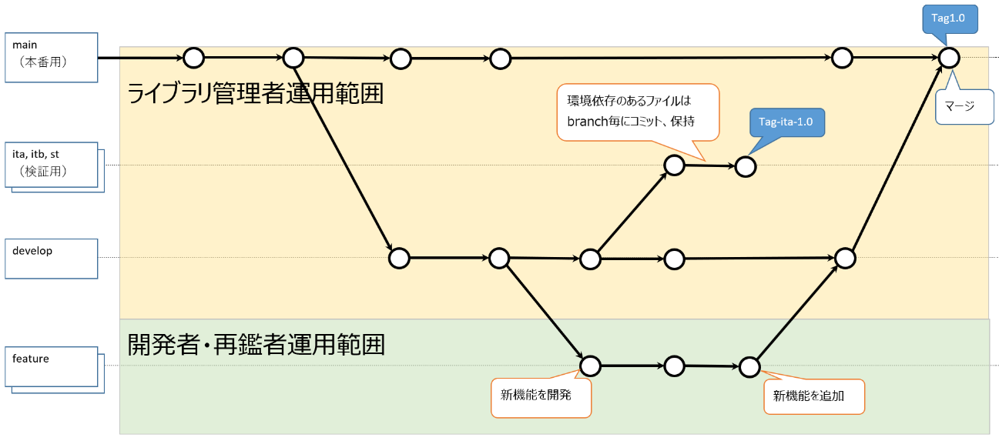
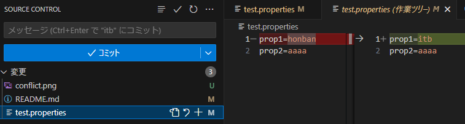
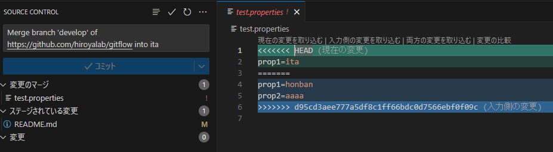
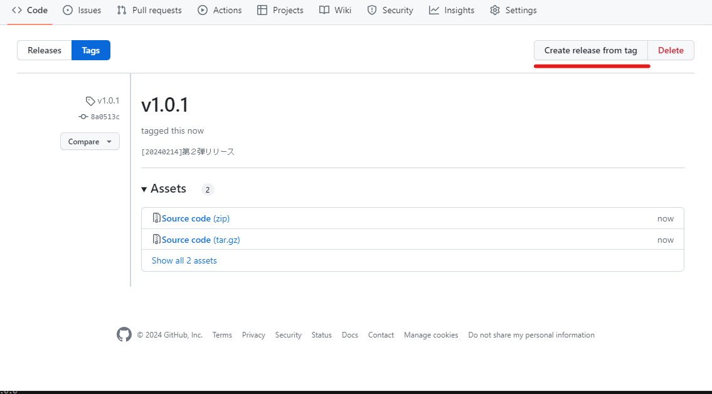
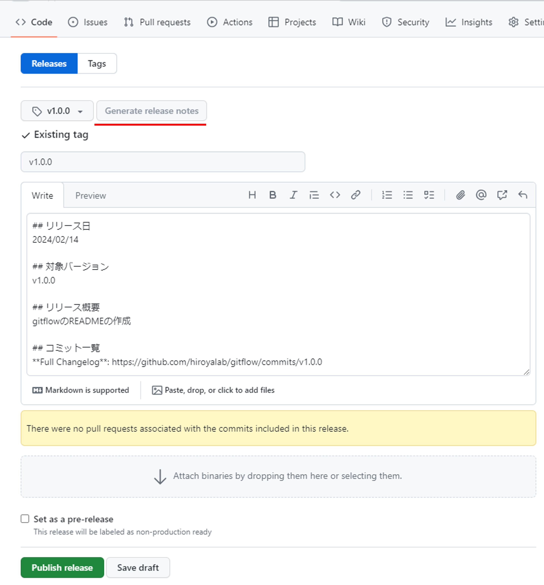

# git運用方針
gitの運用方針を整理

***
***

## ブランチ管理

| branch | 用途 | 作業者 |
| ---- | ---- | ---- |
| main | 本番リリース用ブランチ<br>直接編集不可、developからのマージのみ許可 | ライブラリ管理者 |
| ita, itb, st, etc... | 検証環境用ブランチ<br>developブランチを親として作成、環境依存のあるファイルは直接編集して管理する。 | ライブラリ管理者 |
| develop | 開発ベースブランチ<br>デフォルトブランチに設定する | ライブラリ管理者 |
| feature | 個人開発ブランチ<br>developブランチへマージしたfeatureブランチはリモートブランチから削除すること | 開発者 |




***
***

## ブランチ運用

### 個人開発ブランチ

 - ブランチ命名規則

    プロジェクトで決めの問題だが、以下サンプル
    ```
    feature/{yyyyMM}/kondo
    ```
 
 - developからブランチ作成

    ```
    git checkout -b feature/202401/kondo origin/develop
    ```

 - コミットメッセージルール

    ここ要検討


### 検証環境用ブランチ

1. developからブランチ作成

    例）リモートのdecelopブランチからitbブランチを作成してリモートに登録
    ```
    git checkout -b itb origin/develop
    git push -u origin itb
    ```
    
1. 環境依存のファイルを更新、push

    IDE等で更新、commit、push

    

1. developの最新を取り込む

    ```
    git pull origin develop
    ```
    ※環境依存ファイルに変更がある場合は競合(conflict)が発生するので解消する。
    
    環境依存はローカル優先で、それ以外はdevelopの変更を取り込む

    これもIDE等で更新、commit、push
    
    

***
***

## リリース運用

1. mainブランチへプルリクエスト
   ```
   main ← develop
   ```
   ※マージ方法は`Rebase and merge`で行う事（mainとdevelopのコミットログを一致させるため）

1. mainブランチをローカルで最新化

   mainブランチをチェックアウト
   ```
   git checkout -b main origin/main
   ```
   すでにローカルにチェックアウトしてる場合はブランチを切替え
   ```
   git checkout main
   ```

   最新化
   ```
   git pull
   ```

1. リリースタグ作成

   リモートのタグ確認
   ```
   git ls-remote --tags
   ```

   リリース単位のタグを作成して、プッシュ
   タグ名は`v0.0.0`の形式
   ```
   git tag -a ｛タグ名｝ -m "[yyyyMMdd]初期リリース"
   git push origin {タグ名}
   ```

1. リリース作成

   gitのタグからリリースの作成「Create release from tag」

   


   リリース情報を記載してリリース
   
   記載内容のフォーマットは以下参考

   ```
   ## リリース日
   2024/02/14

   ## 対象バージョン
   v1.0.0

   ## リリース概要
   gitflowのREADMEの作成

   ## コミット一覧
   **Full Changelog**: https://github.com/hiroyalab/gitflow/commits/v1.0.0
   ```
   Full Changelogは下図の「Generate release notes」をクリックすると自動で出来る

   

***
***

## リポジトリ設定(settings)
[個人開発用のGitHubリポジトリで設定した項目たち](https://peno022.hatenablog.com/entry/github-repository-settings)

### General（基本設定）
 - Default branch
    
    `develop`

 - Features

    | Features | 利用 | 概要 |
    | ---- | ---- | ---- |
    | Wikis | ON | ウィキ。README以外に使う感じ |
    | Issues | ON | 問題ページ |
    | Sponsroships | OFF | スポンサー？使わない |
    | Preserve this repository  | OFF | gitの保存。いらない |
    | Discussions | OFF | ディスカッション。いらない |
    | Projects  | OFF | プロジェクトの連携？。いらない |

 - Pull Requests

    | 種別 | 利用 | 概要 |
    | ---- | ---- | ---- |
    | Allow merge commits | ON | マージコミットを入れるやつ |
    | Allow squash merging | OFF | スカッシュ。よくわからんので無効 |
    | Allow rebase merging | ON | リベースしてコミット。<br>mainとdevelopのコミットログを合わせたいので有効 |

    [GithubでのWeb上からのマージの仕方3種とその使いどころ](https://qiita.com/ko-he-8/items/94e872f2154829c868df)

 - Always suggest updating pull request branches 
   `有効`

   PRを作成してからベースブランチに新たに変更が入った場合、画面上に「ブランチを更新する」ボタンが表示されるようになります。

 - Allow auto-merge 
   `無効`

 - Automatically delete head branches
   `有効`

   プルリクエストマージ後に作業ブランチを自動で削除します。

### Branch protection rules（ブランチルール）
   [GitHub Branch protection rulesの機能一覧](https://zenn.dev/dzeyelid/articles/b8309a130d3b3b)

|項目|小項目|説明|main|develop|ita, itb, etc…|
|:----|:----|:----|:---:|:---:|:---:|
|Require a pull request before merging| |マージする前に、プルリクエストを要求する|○|○|○|
| |Require approvals|プルリクエストにおいて、承認（approval）を要求する|○|○|○|
| |Dismiss stale pull request approvals when new commits are pushed|新しいコミットがプッシュされたときに古い承認を取り消す|○|○|○|
| |Require review from Code Owners|Code Ownersによるレビューを要求する|-|-|-|
| |Restrict who can dismiss pull request reviews|プルリクエストのレビュー（変更を要求するレビュアによる承認を必要とする状態）を却下できる人を制限する|-|-|-|
| |Allow specified actors to bypass required pull requests|指定したユーザーに対し、プルリクエストの要求を課さない|-|-|-|
| |Require approval of the most recent reviewable push|Approvalを得た後にプッシュされた変更がある場合は、approvalを要求する 最後のレビュー可能なpushを行った人以外からのapprovalを要求する|-|-|-|
|Require status checks to pass before merging| |マージする前に、status checkをクリアしていることを要求する|○|○|○|
| |Require branches to be up to date before merging|マージする前に、作業ブランチが最新（マージ先のブランチの変更が取り込まれている）であることを要求する|○|○|○|
|Require conversation resolution before merging| |マージする前に、プルリクエストのconversation（コメント）が解決されていることを要求する|-|-|-|
|Require signed commits| |署名付きのコミットを要求する|-|-|-|
|Require linear history| |履歴の分岐を許さない|-|-|-|
|Require merge queue| |マージキューを要求する|-|-|-|
|Require deployments to succeed before merging| |マージする前に、deploymentsが成功することを要求する|-|-|-|
|Lock branch| |ブランチをロックする（プッシュを禁止する）|-|-|-|
|Do not allow bypassing the above settings| |（管理者とカスタムロールで"bypass branch protections"の権限を持つユーザーに対し）上記の設定のbypassを許さない|-|-|-|
|Restrict who can push to matching branches| |対象のブランチに対し、pushできる人を制限する|-|-|-|
| |Restrict pushes that create matching branches|命名規則が合致するブランチの作成ができる人を制限する|-|-|-|
|Allow force pushes| |force pushを許す|-|-|-|
|Allow deletions| |ブランチの削除を許す|-|-|○|

***
***


## 参考
 - [複数人開発の際にはGitのワークフロー、GitFlowとGitHub Flowを導入すると便利です](https://qiita.com/yousan/items/f0801437644527b00342)
 - [Git コンフリクト解消手順](https://qiita.com/crarrry/items/c5964512e21e383b73da)
 - [【Git】コンフリクト(conflict)が発生しても大丈夫な対処法まとめ](https://qiita.com/shizen-shin/items/391aac7b9febaf11bde6)
 - [git tagの仕様・使い方](https://www.kagoya.jp/howto/rentalserver/webtrend/gittag/)
 - [文字の色コード](https://www.colordic.org/w)
