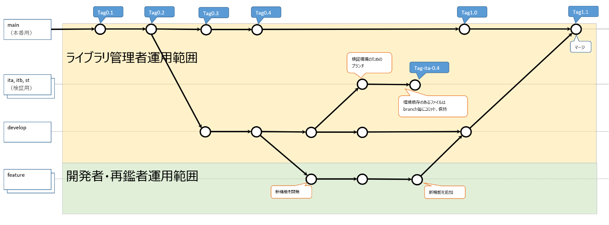

# git運用方針
gitの運用方針を整理

## ブランチ管理

| branch | 用途 | 作業者 |
| ---- | ---- | ---- |
| main | 本番リリース用ブランチ 直接編集不可、developからのマージのみ許可 | ライブラリ管理者 |
| ita, itb, st | 検証環境用ブランチ developブランチを親として作成、環境依存のあるファイルは直接編集して管理する。 | ライブラリ管理者 |
| develop | 開発ベースブランチ | ライブラリ管理者 |
| feature | 個人開発ブランチ developブランチへマージしたfeatureブランチはリモートブランチから削除すること | 開発者 |

